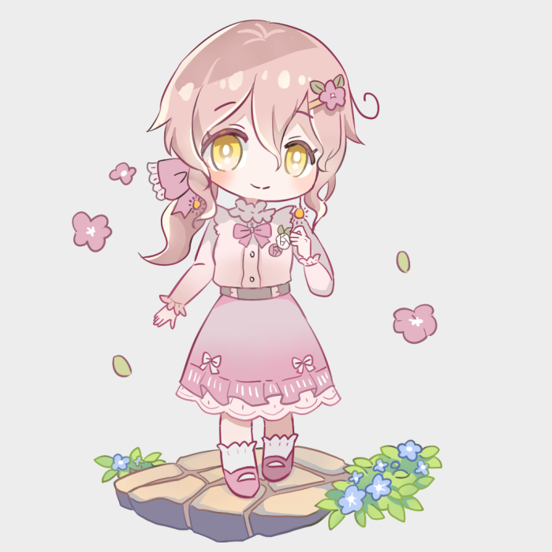
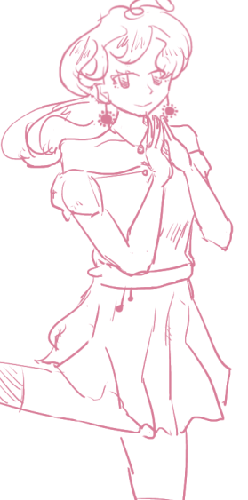

+++
date = '2024-12-27T18:43:57+08:00'
draft = false
title = '【研究員】溫旭景'
+++
---

[紙娃連結](https://www.neka.cc/composer/13224)

> *「如果能夠捨棄不必要的情感，人類也是種很了不起的生物呢。」*
> 

**基本資料：** 兵器部研究員，邦離的下屬，曾引咎辭職後又復職。

**外貌：** 166公分。漂亮大姊姊。珊瑚粉的自然波浪捲髮綁成馬尾，眼睛是明亮的旭日黃。喜歡耳環、項鍊等配件，也會打扮得精緻大方，但對於打理髮型不感興趣，導致頭髮亂亂的甚至有些雜毛。最常配戴的耳環是一個跟眼睛顏色差不多的太陽造型。

「不覺得看起來就很有活力嗎～總是像陰天一樣悶悶的實驗室很需要吧。」是這麼說的。

**個性：** 從容、優雅、開朗，個性有點綠茶的天才研究員。沒有所謂的憐憫心跟罪惡感，認為為了目標和成就的犧牲都是可以允許的。是個生活白癡，除了工作以外的事經常搞砸，常常闖禍、但補救能力也是一等一。

是不會出爾反爾、不會懷疑自身的混亂中立，覺得為了某件事犧牲某些事十分正常。自己的長才在此，所以不可能推翻吧、這些被國家看重的研究產物。
可以做得很好那為何要改變呢？她在這裡如魚得水，為什麼要憐憫那些耗材？人類可能是沒救的生物，但在這些生物體上自己是金字塔的尖端，也很不賴呢。

**重要生平：** 並不是對任何領域有興趣的人，相反地因為很聰明做什麼都快，沒有什麼明確志向。然而她在學習中理解現代電子科技、大數據蔚為風潮，因此決定走往二類的資訊學群。同時也跨領域地學習理工內的電子器械維修，在高中時期參與國際型的機器人賽事奪得金獎，卻在獲獎感言時說了「我認為人類應當也要往身體機能機械化邁進才對」這樣的話讓現場群眾有些咋舌，最後這個節目沒有播出，卻引來LG的興趣，因此邀請她去LG實習。隔年轉正。

溫旭景比起製作，在發想以及管理的長才更令人看重，因此事後調任至兵器部門、負責部分實驗體，了解到了國家的特殊兵器計畫，也遇見該部門的邦離。其中一名實驗體就是萩眠。然而之後萩眠逃離實驗中心，還被國際刑警組織SEC撿到，引發不小的風波。高層表示需要有人負責，想讓溫旭景擔當這個角色，旭景覺得沒什麼關係、因此對外解釋後引咎辭職。風評褒貶不一。

在辭職的這段期間做的是子公司的資訊整理業務。因為能力好的關係LG自然不可能完全放棄她。被秘密邀請重回LG任職時，邦離已經是她的上司了。

 



- 會抽菸，但沒有菸癮
- 溫絮里的堂妹
- 雖然彷彿沒有人性，但並不是沒有感情。少女有的心思她也有的
- 物慾偏高但不會特別珍惜


 


20歲：被邀請進入LG子公司學習
21歲：正式進入研發部門
23歲：調任進兵器部門工作
25歲：萩眠逃離實驗中心，溫旭景引咎辭職
28歲：秘密重回LG工作
31歲：核爆發生



    
繪師：噗浪轉蛋

繪師：野兔

溫旭景初設。


    

    - 目前無


---

> **對邦離的看法：**
> 
> 
> 競爭對手，上司，老同學，也可能算是摯友？不知道呢。
> 
> 在學生時期兩人個性比起現在更加鮮明，也因此互相為天才的他們有機會一窺彼此內心的本性。心照不宣地互相協助，以及保守秘密。說熟也不算很熟，但絕對不僅止於同事同學關係，先前共事時關係不錯於是離職時也有接續聯絡。
> 
> 「無數次看他處理事情、完成任務時，總是各方面都很完美。時機恰好、滴水不漏、毫無懸念地，在舞台上鮮花和掌聲內以最漂亮的謝幕作結。」
> 
> 「面對這樣的人，即使沒有勝負心也會好奇吧？好奇自己能干涉他的表演到什麼地步呀。所以哪怕大部分時間會輸，還是不想放棄呢——和組長博弈競爭的機會。」
> 

> **對溫絮里的看法：**
> 
> 
> 知道對方能力出眾，也知道對方清冷底下的瘋狂本性，基本上在所有成員裡最了解他。
> 
> 對於對方抱持一種「堂哥來啦？好耶那就不用擔心了！反正怎麼搞砸實驗體都有他幫我收拾！」的愉悅感，表面上像是不用擔心研究過當，實際上知道絮里就喜歡看慘一點的實驗體，下手重一點非常ok。這種不由分說的默契。
> 
> 溫絮里稱呼她為「堂妹」，但旭景會直接叫他「溫絮里」。
> 

> **對萩眠的看法：**
> 
> 
> 前實驗體。沒什麼特別的看法，覺得對方有點無趣。但畢竟是成功的實驗體，對他稍微稍微下手有輕一點吧。
>