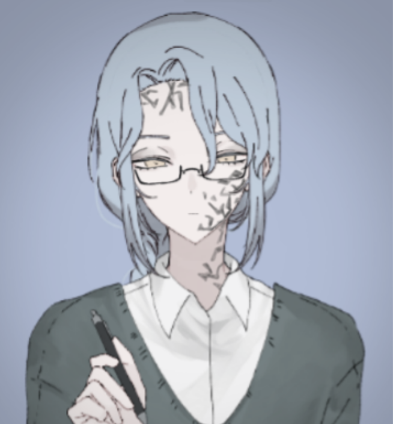
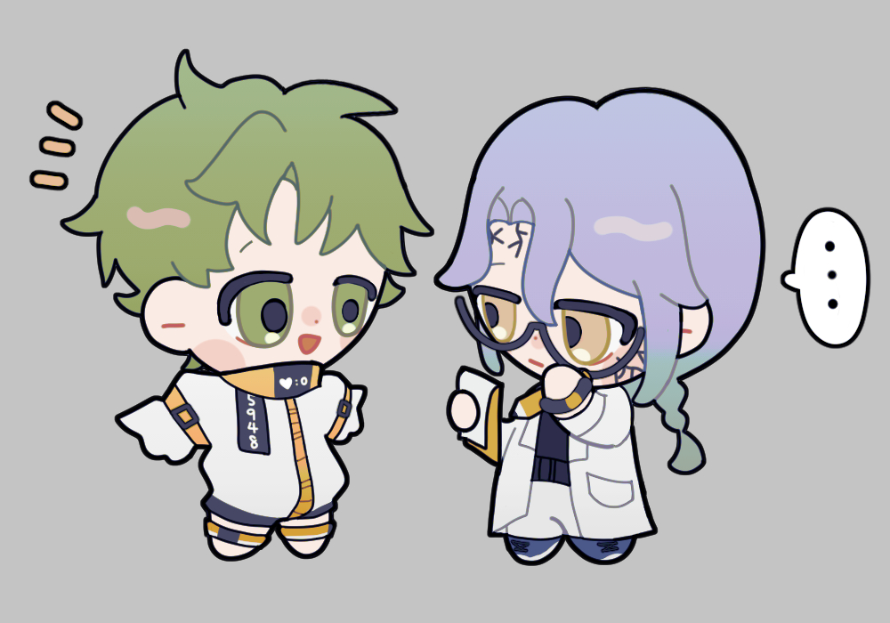
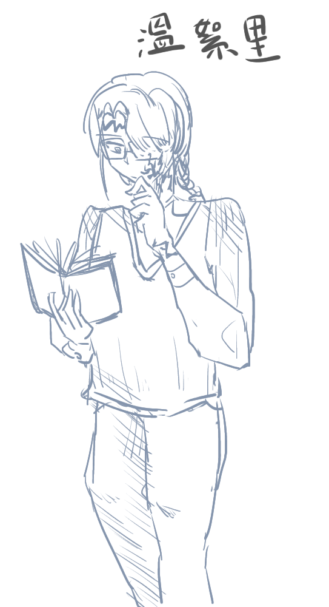

# 【實驗體醫生】溫絮里

---

[紙娃連結](https://www.neka.cc/composer/13224)

> *「人一旦認為自己是可悲的，那他的人格就毀了；無理由一昧正向積極也是另一種不切實際的自我毀滅。順帶一提，這兩種我都不喜歡看。」*
> 

**基本資料：** LG醫療部門，同時為人型實驗體醫生。也是崔顯的主治醫師。

**外貌：** 166公分。薄藍色髮，淡米黃色眼睛（無特定色號，不要與例圖相差太遠的自由發揮都行），是柔和清冷的長相。戴眼鏡，綁單辮，因為怕冷會穿毛衣或是背心，穿著有些英倫風。臉上有裂紋一般的刺青。笑起來有酒窩，不過不常笑。臉色讓人感覺長期睡眠不足。

**個性：** 與表面冷靜自持的氣質不同，其實特別喜歡毀滅性的事物，當醫生也是為了近距離接觸。常常被說明明叫聽起來這麼溫柔的名字、結果是可怕的人。
做事俐落、一針見血。對於不喜歡的人多少有點不耐煩。厭蠢，跟冒犯到界線的人說話會難免地帶刺。生氣時會冷冰冰地發洩。不罵髒話，也討厭別人罵髒話。
鍾情於程度誇張、具有破壞性的元素，有機物身上從有機到無機的快速化學變化，以及在這之中的劇烈擺盪會使他心動。

**重要生平：** 家裡蠻有錢的，父母是政治人物，不過絮里卻想從醫。父母有點意外不過依然支持。

絮里的個性形塑一部分來自小時候長時間有受過騷擾，而且是被同性，不過那時候還小、只是覺得很奇怪有些不舒服，但也沒有概念覺得那是錯誤的。因為教育上畢竟偏向要男人強勢、獨立，沒有人教小男生要保護自己，於是他也沒有跟任何人說過。對方一直進行很刻意的、溫柔的觸碰，讓年幼的他很反感，因此直到現在溫絮里都不喜歡有人用明顯營造出來的溫和對待他。

騷擾事件行跡敗露的那天是因為在室外，有人正好看到他上下其手的一幕抓現行犯，那人倉皇逃跑，結果跑到馬路上被疾行而來的巴士撞飛。

溫絮里見證他變得血肉模糊的那一刻，突然感到前所未有的舒爽，那就像是長期如蛆蟲啃食的不適、以及困住他的枷鎖突然應聲而碎，啪一聲沒了的感覺。從那時候就開始有個性歪曲的跡象了。刺青也是在那之後決定的，為了更改柔和的長相。



- 負責治療全部人形實驗體在實驗中受的特殊傷害跟病症
- 有失眠困擾，會吃自己給自己開的安眠藥。但如果是在崔顯附近可以睡得著
- 本能地喜歡工作。對於重傷病患治療時動作溫柔，原因是他看見傷口很高興，因此會讓病患有種自己像是玩具被拆解、修復的毛骨悚然感
- 是溫旭景的堂哥
- 出國時期有一個男朋友，英國生物學教授：泰倫斯．沃克，現已分手
- 動物塑是黃瞳狸花猫
- 除了臉上有刺青以外，後背也有一些，但幾乎沒有人知道。後背是煙火的圖案，像燦爛誇張的花





24歲：被招聘進入LG工作
26歲：出國深造、學習，認識泰倫斯．沃克
29歲：與泰倫斯分手，歸國重新任職，赴日替SEC治療傷患
31歲：接管兵器實驗失敗的崔顯，成為其輻能實驗負責人之一
32歲：核爆發生




    
    左為崔顯，右溫絮里。繪師：安提
    
    
    溫絮里初設。
    

    

  - [一次赴日出差](https://docs.google.com/document/d/1tV9ayM6x_Dcc1hXQwgpB2L_yXfS4r2sOKw3RGHaD89M/edit?usp=sharing)
  - [關於前任](https://docs.google.com/document/d/1XqfOla222Lz_LhkHsIkiNEn8BEgyJNC4ma9IrhklExw/edit?usp=sharing)


---

> **對崔顯的看法：**
> 
> 
> 感情很複雜。但基本上表現出的是不喜歡。只會叫崔顯代號（5948），從崔顯15歲時開始負責他的治療以及身體狀況監管。崔顯不像一般的實驗體，太純且天然的個性讓溫絮里會感到有點煩躁，即使受了重傷也是那樣心情頗好的樣子讓他不知道怎麼應對、因此乾脆保持討厭的態度。
> 
> 「討厭一個人不需要什麼理由，你也不需要因為這樣改變什麼。比我討厭你的人很多，尤其你以後需要為國家做事，討厭你的人會更多。」
> 
> 29歲因為經歷的關係他釐清了一些思緒，帶著這些回到職場，更確定自己想要的東西，所以也稍微比較放開一點。人一旦確定自己喜歡什麼跟討厭什麼之後，就會急著想尋找例子，向自己的人格證明自己學會新概念。崔顯符合自己不喜歡的樣子，所以他就去討厭，而且對方看起來也不介意。
> 
> 但，也不是真的討厭吧。畢竟這麼熟悉了，在他身邊的話總是能睡得很安穩呢。
> 

> **對溫旭景的看法：**
> 
> 
> 知道對方能力出眾，也知道對方親和底下的瘋狂本性，基本上在所有成員裡最了解她。對於被父親囑咐的照看她、偶爾替她善後的工作，溫絮里表面上保持「算了吧，誰叫她是從小一起長大的家人」的態度，但其實能有知曉自身本性的熟人在同個工作場域還是蠻令人安心的。算是最重要的親人。
> 
> 稱呼她為「堂妹」，但旭景會直接叫他「溫絮里」。
> 

> **對莫鯨的看法：**
> 
> 
> 同事。溫絮里覺得他是詭異的怪人，看上去有病的心理醫生。不過雖說莫鯨稍微符合「刻意營造的溫柔」，卻不是有意要從他這裡得到什麼，況且他知道莫鯨不是什麼善類，因此並不討厭。
> 

> 對邦離的看法：
第一印象是溫旭景的上司。覺得對方是個厲害的天才，個性也讓他很欣賞。挺好。
>