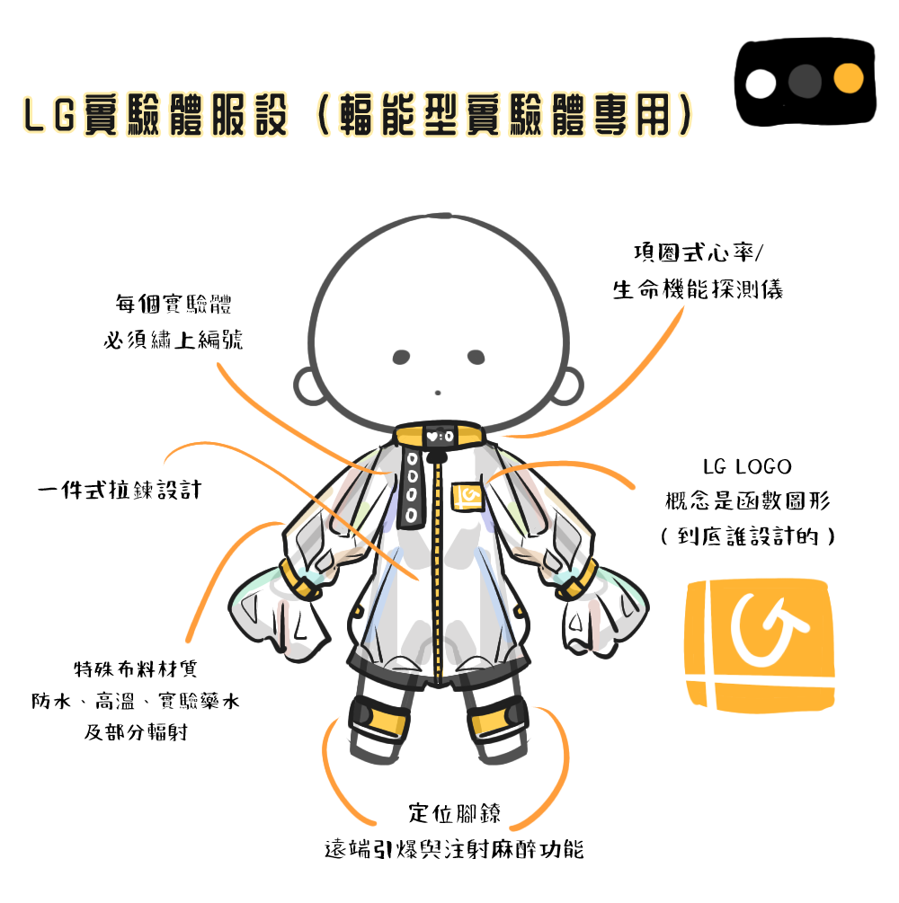
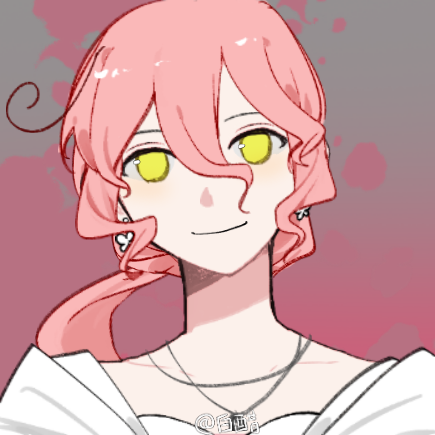
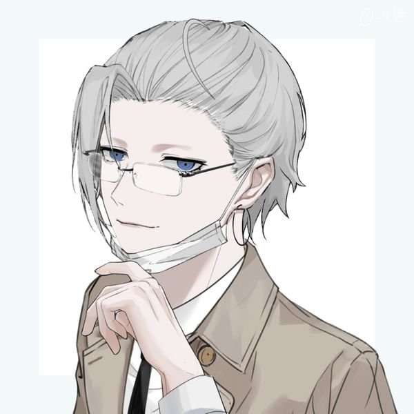

+++
date = '2024-12-26T21:52:01+08:00'
draft = false
title = '【LG國家實驗室】設定集'
+++

> *LG國家祕密計畫實驗中心 —— Laboratory Generation*
> 

# *「他們奉行以科學開闢新世界的道路，在世代的前端進行研究的使命。」*

---

### **實驗中心簡介**
 
國家級的秘密實驗中心，對外是普通的國營研究機構，實際上負責一些無法對外公開的暗面研究，危險物質、生化武器、人體實驗等都是LG負責的範疇。
 
 

下分為：<ul style="list-style: none; margin: 0; padding: 0;">
  <li style="color: #9a57d3; display: inline; margin-right: 1rem;">研發部門</li>
  <li style="color: #32CD32; display: inline; margin-right: 1rem;">生物科技部門</li>
  <li style="color: #1E90FF; display: inline; margin-right: 1rem;">兵器部門</li>
  <li style="color: orange; display: inline; margin-right: 1rem;">輻能應用部門</li>
  <li style="color: pink; display: inline;">醫療部門</li>
</ul>
 

各個部門並非獨立行事，而是彼此合作、相輔相成，並時常共同實行國家發配的研究任務。

 


功能：直接與政府交涉並下派實驗及其他任務，擁有命令與決議權
成員：寒鳴，磁

    

功能：負責製作、研發其他部門所需工具及上市產品，也是對外推出成果的主要部門
成員：目前無



成員：曹錦
   


功能：負責研發攻擊、防禦性專武。涉及人體改造實驗，是最被看重、同時也是最為不人道的部門
成員：邦離，溫旭景，萩眠（已退出）
 


  功能：將輻能相關能源轉換為可用資源，包括但不限於各種放射性物質相關研究
  成員：崔顯
  > 實驗體制服
  
 

    

  成員：溫絮里，莫鯨


[**LG時間線/大事記**](https://docs.google.com/spreadsheets/d/1uM2F99fcH2bp2IIo5Pt7YBVOX69WafzMMqpdo93kYig/edit?usp=sharing)：與其它原創組織相關者會標註黃色，僅供參考

---

### **成員簡介**
 

**【長官】 寒鳴**

**【研究員】邦離**



  兵器部天才組長，LG的白月光。實際上是核爆幕後黑手。


    

    
  有些斑駁的灰髮，如同月亮一般，給人一種溫和可靠的感覺。
   

  

    
  非常自我中心、張揚、自信。很聰明的人，什麼東西都一學就會。
   



    
  血型：A
  生日：10/4
  體型：174/68
  背景：家裡有父母加他三個人。




    
  無
   


**【研究員】溫旭景**


  兵器部研究員，邦離的下屬，曾引咎辭職後又復職。

    

  漂亮大姊姊。珊瑚粉的自然波浪捲髮綁成馬尾，眼睛是明亮的旭日黃。喜歡耳環、項鍊等配件，也會打扮得精緻大方，但對於打理髮型不感興趣，導致頭髮亂亂的甚至有些雜毛。

[紙娃連結](https://www.neka.cc/composer/13873)


    

  從容、優雅、開朗，個性有點綠茶的天才研究員。沒有所謂的憐憫心跟罪惡感，認為為了目標和成就的犧牲都是可以允許的。是個生活白癡，除了工作以外的事經常搞砸，常常闖禍、但補救能力也是一等一。

    
    

  - 會抽菸，但沒有菸癮
  - 溫絮里的堂妹
  - 雖然彷彿沒有人性，但並不是沒有感情。少女有的心思她也有的
  - 物慾偏高但不會特別珍惜



 

[【研究員】溫旭景](../../character/溫旭景.md)

[邦離&溫旭景：COC TRPG 互動參考](../../TRPG/邦離_溫旭景_如月車站.md)

    
    
    

**【研究員】曹錦**

**【實驗體】崔顯**


因為兵器部門研究失敗，所以被轉移到輻能應用部門的實驗體。代號：5948。

    

23歲，卻透露出一股青少年感。淺橄欖綠的頭髮色與眸色，總是掛著笑臉，好親近又充滿正能量。

    
    

總是帶著笑容，情緒開心且高昂，很少有事情能令他情緒低落，作為實驗體也不太怕痛。對事物的危機感有所缺乏，即使是做實驗又或是療傷時的心情也都很好。因為從小在實驗室長大，所以一般的道德常識有些缺乏，是天然黑的類型。

    
    

- 輻射沒辦法對他造成肉體上的影響，卻會影響他的記憶。
- 因為會忘記事情，所以身上會刺重要的事物。
- 看起來很乖但因為有點天然黑會不小心做壞事不自知。



無


**【實驗體醫生】溫絮里**


醫療部門，同時為人型實驗體醫生。也是崔顯的主治醫師。

    
    

薄藍色髮，淡米黃色眼睛，是柔和清冷的長相。戴眼鏡，綁單辮，因為怕冷會穿毛衣或是背心，穿著有些英倫風。臉上有裂紋一般的刺青。笑起來有酒窩，不過不常笑。臉色讓人感覺長期睡眠不足。

[紙娃連結](https://www.neka.cc/composer/13224)


    

與表面冷靜自持的氣質不同，其實特別喜歡毀滅性的事物，當醫生也是為了近距離接觸。常常被說明明叫聽起來這麼溫柔的名字、結果是可怕的人。
做事俐落、一針見血。對於不喜歡的人多少有點不耐煩。厭蠢，跟冒犯到界線的人說話會難免地帶刺。生氣時會冷冰冰地發洩。
鍾情於程度誇張、具有破壞性的元素，有機物身上從有機到無機的快速化學變化，以及在這之中的劇烈擺盪會使他心動。

    
    

- 負責治療全部人形實驗體在實驗中受的特殊傷害跟病症
- 有失眠困擾，會吃自己給自己開的安眠藥。但如果是在崔顯附近可以睡得著
- 本能地喜歡工作。對於重傷病患治療時動作溫柔，原因是他看見傷口很高興，因此會讓病患有種自己像是玩具被拆解、修復的毛骨悚然感
- 是溫旭景的堂哥
- 出國時期有一個男朋友，英國生物學教授：泰倫斯．沃克，現已分手
- 基本上只會叫崔顯代號（5948）
- 小時候長時間受過同性騷擾，因此極度不喜歡有人用明顯營造出的溫和態度對待他
- 動物塑是黃瞳狸花猫



[**【實驗體醫生】溫絮里**](../../character/溫絮里)
    

    

**【解洗腦專家】莫鯨**


醫療部門，LG內的解洗腦專家，主要負責精神科、心理疾病方面的治療。

    
    

淺灰髮，如深海般的普魯士藍瞳，皮膚白皙且五官深邃得不像東方人，眉毛淡到幾乎看不見、但眉肱骨深。總是掛著靜靜的、有幾分精明氣質的內斂笑意。

[紙娃連結](https://www.neka.cc/composer/13224)

    

    

斯文敗類。是會「^^」的標準類型。

    
    






**【清潔工】磁**

**【實驗體】萩眠**